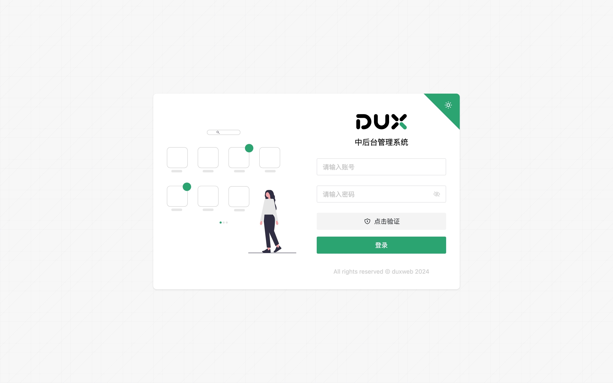
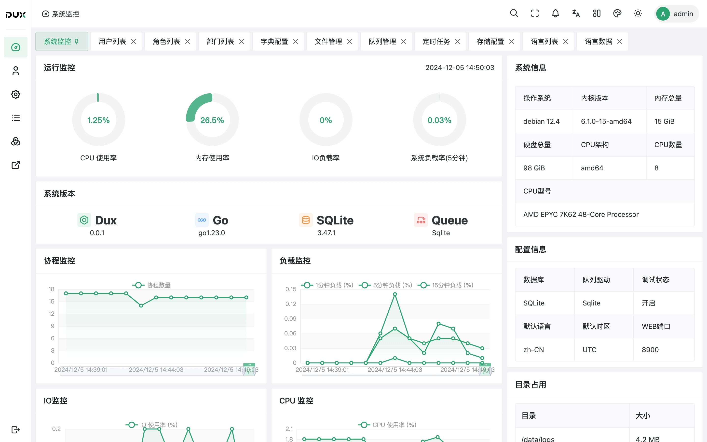
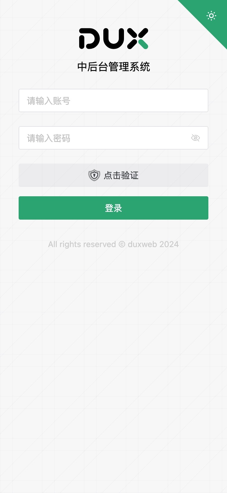
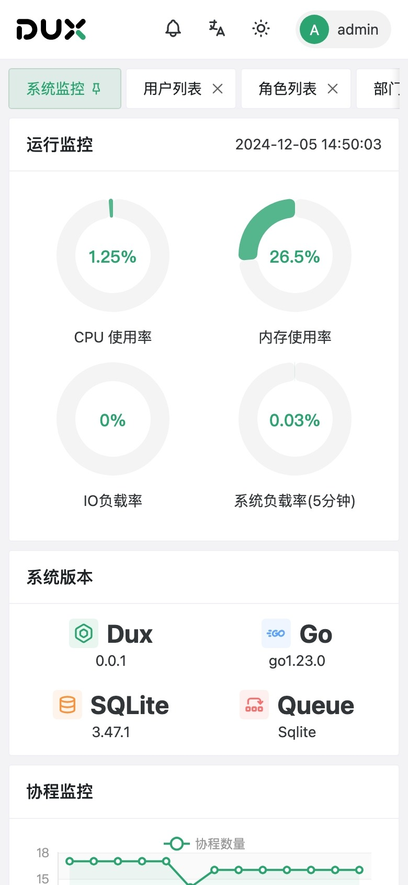
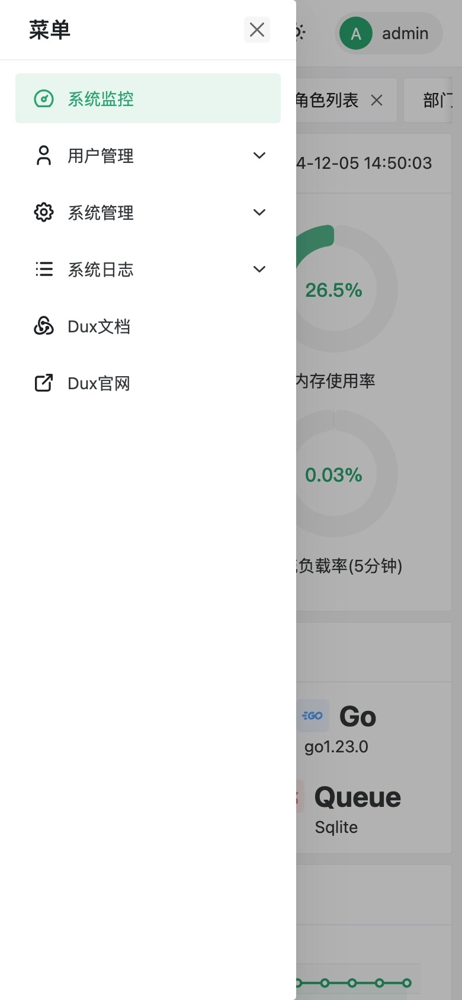
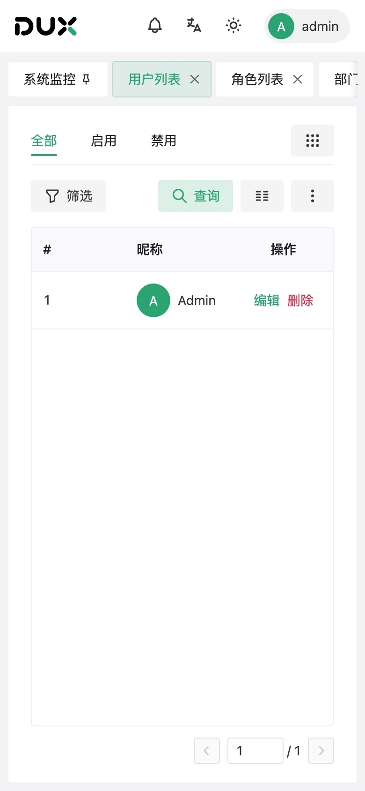

<h1 align="center">
  Dux Vue Admin
</h1>

<p align="center">
  <strong>适用于全栈开发的异步中后台前端解决方案</strong>
</p>

<p align="center">
  <em>免编译、免打包、免依赖、开箱即用</em>
</p>

## 🌟 特性

- 🏗️ **主流架构**: 基于 Vue3、Vite、TypeScript、Pinia、Vue Router、Naive UI、UnoCss 作为基础架构
- 📄 **Json渲染**: Json 渲染器，仅用 Json 即可渲染为 Vue 组件，可用于低代码渲染平台
- 🌐 **远程渲染**: 基于 Vue Sfc 的运行基座，异步加载 Vue 或 Json 并渲染，无需编译和打包
- 👶 **新手友好**: 无论是新手还是老手，都能快速上手，特别针对后端全栈开发，提供优秀的解决方案
- 💼 **高级组件**: 提供异步高级组件，如：表格、表单、选择、级联、动态输入等
- 🎨 **UX & UI**: 优秀的用户体验和美观的界面设计，满足各种业务需求
- 🗣️ **语言与主题**: 支持 i18n 国际化，主题色彩、多种布局，支持明暗自适应色彩，移动端自适应
- 🆓 **免费开源**: 基于 Apache 2.0 协议，免费开源，可商用

## PC截图

<p align="center">


</p>

## 移动端截图

<p align="center">




</p>


## 📚 文档

详细文档请访问：[https://vue-docs.dux.plus](https://vue-docs.dux.plus)

## 🎯 在线演示

纯前端演示地址：[https://vue-admin.dux.plus](https://vue-admin.dux.plus)

后端Go演示地址：[https://go-admin.dux.plus/manage](https://go-admin.dux.plus/manage)，演示账号：admin/admin

## 📦 开发环境

- Node.js >= 21.0.0
- bun >= 1.x

## 🚀 快速开始

### 传统模式

```bash
# 创建项目
npx degit github:duxweb/dux-vue-admin-template/packages/legacy my-project

# 进入项目目录
cd my-project

# 安装依赖
bun install

# 启动项目
bun run dev
```

### 基座模式

```bash
# 创建项目
npx degit github:duxweb/dux-vue-admin-template/packages/mount web

# 进入项目目录
cd web

# 安装依赖
bun install

# 编译基座
bun run build
```


## 💡 技术栈

- 核心框架：Vue 3
- UI 框架：Naive UI
- 状态管理：Pinia
- 网络请求：Alova
- 样式方案：Unocss
- 特色技术：异步渲染、远程加载

## 🔥 适用场景

- 后端全栈开发团队
- 快速原型开发
- 中小型项目快速落地
- 需要高度定制的企业级应用

## 📄 开源协议

[LGPL 3.0](LICENSE)

## 🤝 支持与贡献

如果你觉得这个项目对你有帮助，欢迎 Star 支持一下。如果你有任何问题或建议，也欢迎提出 Issue 或 Pull Request。

## 🔗 相关链接

- [文档](https://vue-admin.dux.plus)
- [在线演示](https://vue-admin.dux.plus)
- [问题反馈](https://github.com/duxweb/dux-vue-admin/issues)